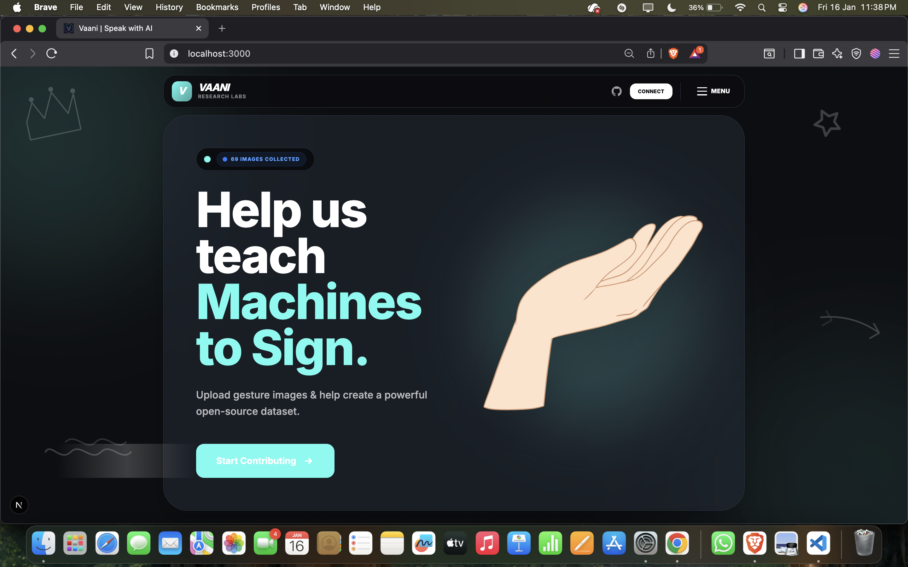
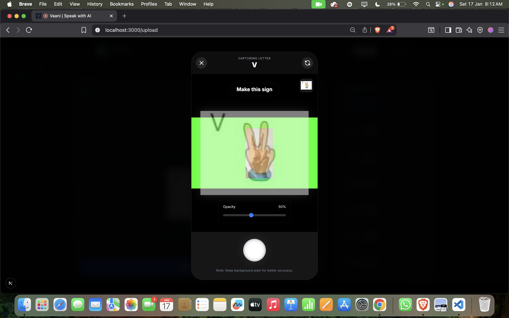
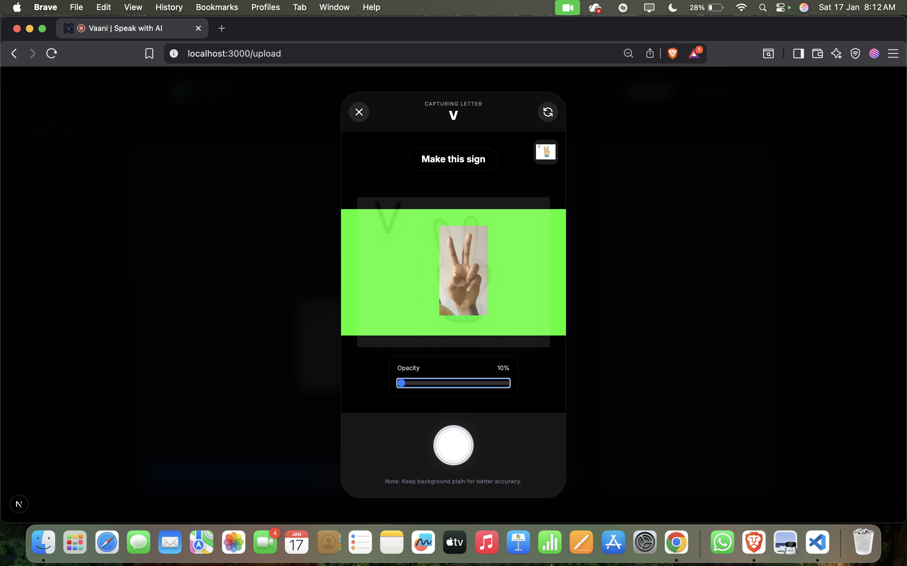

# 🗣️ VAANI - Indian Sign Language Dataset Collector


> **Bridging the gap between silence and sound.** > A community-driven initiative to build a large-scale, open-source Indian Sign Language (ISL) dataset for AI training.

---

## 📖 Table of Contents
- [About the Project](#-about-the-project)
- [Key Features](#-key-features)
- [Tech Stack](#-tech-stack)
- [How It Works](#-how-it-works)
- [Getting Started](#-getting-started)
- [Environment Variables](#-environment-variables)
- [Contributing](#-contributing)
- [Contact](#-contact)

---

## 🚀 About the Project

**VAANI** is a web application designed to crowdsource hand gestures and sign language data. The lack of diverse, high-quality datasets for **Indian Sign Language (ISL)** is a major barrier in developing accurate AI translation tools for the mute and deaf community.

This platform allows users to record gestures via their webcam. We use **Google MediaPipe** to validate that hands are visible in the frame before recording, ensuring high-quality data collection.




---

## ✨ Key Features

* **Real-time Hand Detection:** Integrated **MediaPipe Hands** to detect hand landmarks instantly. The "Record" button is only enabled when hands are detected in the frame.
* **Multi-Language Support:** The UI is accessible in **English, Hindi, and Marathi** to encourage contributors from diverse regions in India.
* **Secure Cloud Storage:** All video data is securely uploaded and stored using **Supabase Storage**.
* **Admin Dashboard:** A dedicated panel for verifying, approving, or rejecting submitted videos.
* **Bulk Export:** Approved datasets can be exported for training Machine Learning models.

---

## 🛠 Tech Stack

| Component | Technology |
| :--- | :--- |
| **Frontend** | [Next.js 14](https://nextjs.org/) (React Framework) |
| **Styling** | [Tailwind CSS](https://tailwindcss.com/) |
| **Backend & Auth** | [Supabase](https://supabase.com/) (PostgreSQL) |
| **AI/ML** | [MediaPipe Hands](https://developers.google.com/mediapipe) (Computer Vision) |
| **Icons** | Lucide React |
| **Deployment** | Vercel |

---

## 🧠 How It Works

1.  **User Login:** Users authenticate (optional, depending on config) to track contributions.
2.  **Select Word:** The user selects a word/phrase (e.g., "Hello", "Thank You") from the list.
3.  **Hand Detection:** The webcam activates. MediaPipe scans for hand landmarks (21 points per hand).
4.  **Recording:** Once hands are detected, the user records the gesture (3-5 seconds).
5.  **Submission:** The video is uploaded to a Supabase Bucket, and metadata is stored in the database.

---

## 💻 Getting Started

Follow these steps to set up the project locally on your machine.

### Prerequisites
* Node.js (v18 or higher)
* npm or yarn

### Installation

1.  **Clone the repository**
    ```bash
    git clone [https://github.com/VishwakarmaVaibhav/Vaani-signlang-dataset.git](https://github.com/VishwakarmaVaibhav/Vaani-signlang-dataset.git)
    cd Vaani-signlang-dataset
    ```

2.  **Install dependencies**
    ```bash
    npm install
    # or
    yarn install
    ```

3.  **Set up Environment Variables** (See section below)

4.  **Run the development server**
    ```bash
    npm run dev
    ```

Open [http://localhost:3000](http://localhost:3000) with your browser to see the result.

---

## 🔐 Environment Variables

Create a `.env.local` file in the root directory and add your Supabase credentials:

```bash
NEXT_PUBLIC_SUPABASE_URL=your_supabase_project_url
NEXT_PUBLIC_SUPABASE_ANON_KEY=your_supabase_anon_key
